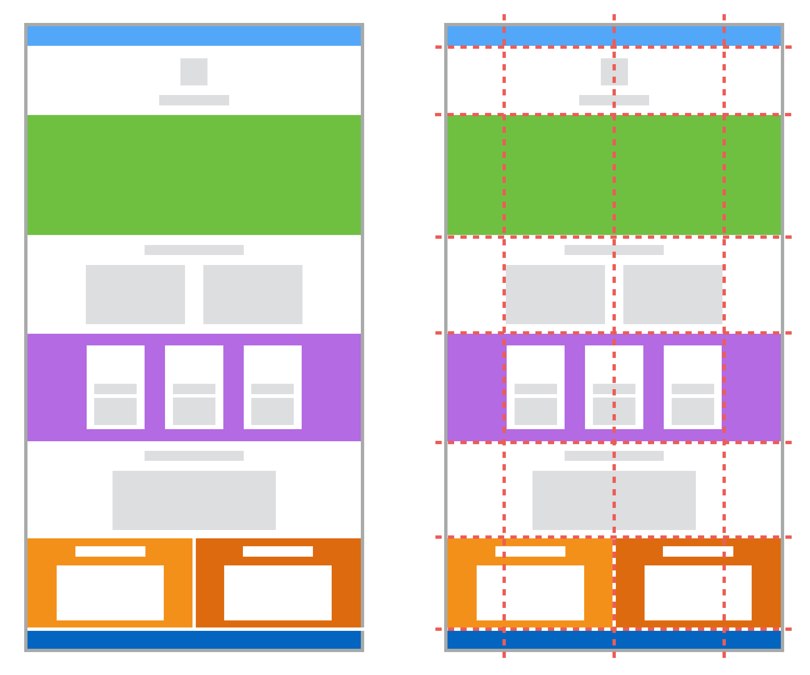
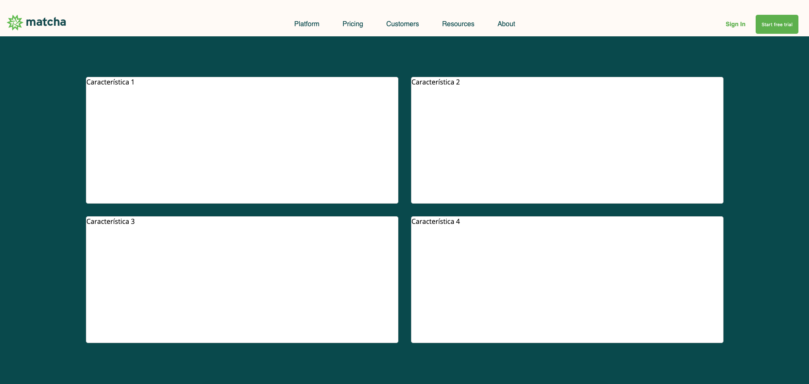
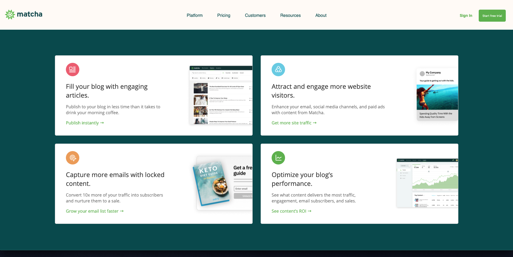

# Sesión: Agregando filas y columnas con CSS Grid

Sigue el contenido a continuación durante clase para que no te pierdas ningún
detalle de lo que estás a punto de aprender.

## Objetivos

En esta sesión aprenderás:

- Usar diferentes propiedades de Felxbox

- Estructurar elementos en formato de filas y columnas.

- Posicionar elementos en base a la posición de otros de manera flexible.

- Usar comandos de git para obtener cambios realizados por terceros.

- Desplegar los cambios a nuestra página web hosteada en Netlify.

## Contenido

### Recuperando los últimos cambios

En la sesión anterior, vimos como obtener cambios de nuestro proyecto que no 
realizamos nosotros a través de los comandos `git fetch` y `git merge`. Debido
a que esta acción puede ser un proceso recurrente en un entorno de trabajo real,
existe un comando que nos puede ayudar a hacer esta tarea más sencilla.

#### Concepto: `git pull`

El comando `git pull` te permite obtener los cambios que han pasado en el 
repositorio que está alojado remotamente en algún servidor (ejemplo: Github) y 
que no lo tienes en tu computadora, a diferencia del `git fetch` que cumple el
mismo objetivo, `git pull` solo lo hace sobre una rama específica y adicionalmente
realiza el `git merge` sin que tu se lo indiques.

:::tip
Para entender mejor este comando, podemos pensar en la siguiente situación:

Imagina que en tu trabajo te asignaron una laptop y estás haciendo una página
que sus cambios son seguidos por Git. Decides que guardarás todos los cambios en
Github para poder mostrarlo con otras personas y de paso tener un respaldo por 
si en algún momento pasara algo a tu laptop. Bien, ahora, decides avanzar algo
de tu trabajo en casa porque te enamoraste del proyecto pero lo haces en tu
computador personal porque no te dejan llevarte la laptop. 

Al día siguiente, regresas a tu trabajo y te das cuenta que tu laptop no tiene
los cambios que tu hiciste en tu casa, pero recuerdas que lo subiste a Github.
Este es el momento en el que un `git pull` te puede salvar. Ya que en este 
momento solo tienes un repositorio remoto (Github) que por defecto toma el alias
de `origin`, y ya que eres la única persona trabajando en ese proyecto y tu rama
por defecto es `master`; terminas escribiendo: `git pull origin master` para 
jalar los cambios que hiciste en casa y que se quedaron almacenados en Github
pero que no tienes en tu laptop del trabajo.
:::


#### Guía: Obteniendo cambios con `git pull`

Como siempre que queremos aplicar cambios relacionados con Git, es necesario que
nos movamos en la terminal hacia la carpeta de nuestro proyecto. Una vez dentro,
vamos a realizar los siguientes pasos:

1. Escribiremos `git pull <nombre-remoto> <nombre-rama>` para traer los cambios 
   que se realizaron desde otro ordenador, ya sea cambios que tu hiciste o que 
   alguien te mandó un Pull Request y terminaste aceptando. Ten en cuenta que
   normalmente por defecto el nombre del remoto es `origin` (lo puedes verificar
   ejecutando `git remote -v`) y si no creaste ninguna rama, tu nombre de la
   rama será `master`.

   En caso de que no tengamos ningún cambio realizado en Github, nos mostrará
   algo similar a:

   ```bash
   # Este comando arrojará algo similar a las siguientes líneas
   $ git pull origin master 
   From github.com:<nombre-usuario>/<nombre-repositoio>
    * branch            master    -> FETCH_HEAD
   Already up to date.
   ```

   Mientras que si tenemos algún cambio que no está en nuestra computadora, se
   verá algo como:

   ```bash
   # Este comando arrojará algo similar a las siguientes líneas
   $ git pull origin master
   remote: Enumerating objects: 74, done.
   remote: Counting objects: 100% (74/74), done.
   remote: Compressing objects: 100% (2/2), done.
   remote: Total 135 (delta 72), reused 72 (delta 72), pack-reused 61
   Receiving objects: 100% (135/135), 250.44 KiB | 1.41 MiB/s, done.
   Resolving deltas: 100% (82/82), completed with 35 local objects.
   From github.com:<nombre-usuario>/<nombre-rerpositorio>
    * branch              master        -> FETCH_HEAD
      58454bc1..00197cd7  master        -> origin/master
   Updating 58454bc1..00197cd7
   Fast-forward
    ruta/al/archivo/modificado.html          |    6 +-
   ```

### Agregando las tarjetas de características

#### Concepto: Grid CSS

El término _grid_, _cuadrícula_ o _rejilla_ en CSS hace referencia a la 
apariencia de filas y columnas que generan los elementos de CSS. Anteriormente,
para lograr esta apariencia solo teníamos los display de `inline-block` y 
propiedades como `float`, posteriormente con la aparición de `Flexbox` podíamos
simular este comportamiento de manera flexible. Sin embargo, no existía ninguna
forma nativa dedicada a este formato que es muy común encontrar en las páginas
web modernas.



Sin embargo, en CSS3 tenemos un nuevo conjunto de propiedades que nos permiten
lograr este objetivo de una manera más práctica y sencillo, que toma el nombre 
de `Grid CSS`.

#### Guía: Agregando características principales de Matcha

¡Empecemos! Vamos a trabajar en la sección de características principales de 
nuestra web.


Aprovechando que su apariencia puede ser construida a partir del uso de filas y
columnas, haremos uso de Grid CSS para llevar a cabo esta parte de la web.

#### Definiendo el contenedor

En Grid CSS, al igual que en flexbox existe una diferencia entre el _grid container_
y los _grid items_. Esto hace refencia a que el contenedor (al que aplicaremos
la propiedad de CSS `display` con valor `grid`) será el *grid container*, 
mientras que los elementos que estén contenidos en él, serán los *grid items*.

Definiendo nuestro contenido se verá algo así:

```html
<!-- Contenido de publicidad viene antes de esta sección -->
<section class="features">
</section>
<!-- Contenido de casos de éxito vienen después -->
```

```css
.features {
  display: grid;
}
```

De esta manera, lograremos crear la sección inicial donde pondremos nuestra
primera grid que contendrá a las características principales de nuestro sitio.

#### Agregando los grid items

En nuestro web, contamos con 4 características principales, distribuidas en 2
columnas y 2 filas, comencemos por definir dichos elementos.

```html
<!-- Contenido de publicidad viene antes de esta sección -->
<section class="features">
  <article>Característica 1</article>
  <article>Característica 2</article>
  <article>Característica 3</article>
  <article>Característica 4</article>
</section>
<!-- Contenido de casos de éxito vienen después -->
```

Si solo agregamos los contenedores de nuestras características, estas se 
mostrarán sin ninguna apariencia en particular (como si el `display: grid` que
agregamos no funcionara) y en realidad es el resutlado esperado, puesto que,
es necesario indicar cómo se van a distribuir los elementos en la grid.

Para esto, podemos usar las propiedades `grid-template-columns` y `grid-template-rows`,
dichas propiedades nos permite especificar la cantidad y tamaño de cada una de
las columnas y filas respectivamente. Veamos un ejemplo, necesitamos definir que
tenemos 2 columnas, imaginemos que sean de `300px`:

```css
.features {
  display: grid;
  grid-template-columns: 300px 300px;
}
```

:::tip

Como tal vez te habrás percatado, la propiedad `grid-template-columns` está 
siendo aplicada al _grid container_ y no a cada _grid item_. Similar a como 
vimos en Flexbox, es necesario saber que la apariencia general del contenido la
definimos en los estilos del contenedor.

Adicionalmente, hemos definimos 2 veces `300px` para indicar que tendremos 2 
columnas de `300px` y de esta manera el contenido toma forma similar a la que 
deseamos.

:::

Probablemente te preguntarás, ¿qué pasaría si tuviéramos 5 columnas en vez de 2
del mismo tamaño, tendríamos que escribir 5 veces `300px`? Para esto, CSS nos
provee de una función llamada `repeat(cantidad, tamaño)` que podemos usar para 
definir cuántas veces queremos repetir un mismo tamaño:

```css
.features {
  display: grid;
  grid-template-columns: repeat(2, 300px);
}
```

Hasta aquí todo bien, sin embargo, estamos de acuerdo que no siempre vamos a 
utilizar un tamaño fijo para indicar el ancho que nuestras columnas van a ocupar.
Si bien, podemos usar las unidades relativas como `%`, `em/rem`, `vw/vh`, etc., 
CSS Grid nos provee con una unidad llamada `fr` (fracción) que se encarga de 
calcular dinámicamente el espacio disponible y dividirlo entre los diversos 
elementos. Veamos algunos ejemplos:

```css
.features {
  display: grid;
  grid-template-columns: 500px 1fr;
}
```

En este caso, estamos definiendo 2 columnas, la primera con un ancho fijo de 
`500px` y la segunda columna con el resto de espacio disponible en la pantalla.
¿Qué pasa si quisiéramos divisiones que ocupen el mismo espacio?

```css
.features {
  display: grid;
  grid-template-columns: 1fr 1fr; 
}
```

Declarando que cada columna ocupe _una fracción_ del espacio disponible, hacemos
que cada una ocupe la mitad del espacio disponible, de esta manera si tuviéramos
cuatro columnas cada una con el ancho de `1fr`, cada columna estará tomando un
ancho del 25% del espacio disponible o 1/4 (depende de que notación les guste y
entiendan mejor).

#### Challenge: Grid con 3 columnas iguales

Queremos indicar que nuestra grid va a contener 3 columnas del mismo ancho 
relativo al espacio disponible en la pantalla. ¿Cómo lo lograrías usando la 
función `repeat(cantidad, tamaño)`?

<details>
  <summary>Posible Solución</summary>

```css
.features {
  display: grid;
  grid-template-columns: repeat(3, 1fr);
}
```

</details>

Genial, ya estamos entendiendo mejor cómo funciona la unidad `fr` y cómo usar
la función `repeat(cantidad, tamaño)`. Cómo agregaríamos las filas que 
necesitamos.

#### Challenge: Grid 2 filas con alto de `330px`

Regresa la cantidad de columnas a las que realmente necesitamos (2) y agrega
la cantidad de filas que usaremos (2) teniendo en cuenta que el alto será de
`330px`. Una vez logrado, ¿cómo se te ocurre que podrías usar la unidad de `fr`
para indicar el alto de las filas?

<details>
  <summary>Posible Solución</summary>

```css
.features {
  display: grid;
  grid-template-columns: repeat(2, 1fr);
  grid-template-rows: repeat(2, 330px);
}
```

Una forma de poder usar la unidad `fr` para asignar el alto de las filas sería
indicando un tamaño fijo al elemento contenedor, en nuestro caso, podríamos 
hacer:

```css
.features {
  display: grid;
  grid-template-columns: repeat(2, 1fr);
  height: 660px;
  grid-template-rows: repeat(2, 1fr);
}
```

</details>

#### Challenge: Grid con 2 filas y 2 columnas

Como en la mayoría de propiedades de CSS, existen muchos atajos para poner
propiedades relacionadas en una sola. Las columnas y filas de CSS Grid no son la
excepción, por lo cual, este reto consiste en obtener el mismo resultado de las
columnas y filas del grid usando la propiedad de atajo.


<details>
  <summary>Posible Solución</summary>

```css
.features {
  display: grid;
  grid-template: repeat(2, 1fr) / repeat(2, 330px);
}
```

</details>

Con esto, tenemos las bases de Grid CSS para poder definir interfaces que se 
adapten al formato de una cuadrícula (filas y columnas). Obviamente, existen
muchas más propiedades y conceptos que descubrir, pero hemos visto lo básico que
nos permitirá continuar con el objetivo.

Teniendo en cuenta que el color de fondo es `#025157` y que las tarjetas no
abarcan todo el espacio de la pantalla podemos personaliza un poco su apariencia
parar que se parezca al resultado final:

```css
.features {
  display: grid;
  grid-template: repeat(2, 1fr) / repeat(2, 330px);
  background-color: #025157;
  padding: 5% 10%;
}
```

Adicionalmente, podemos agregar una clase común a cada característica para darle
la apariencia general que todas las tarjetas comparten:

```html
<section class="features">
  <article class="feature-card">Característica 1</article>
  <article class="feature-card">Característica 2</article>
  <article class="feature-card">Característica 3</article>
  <article class="feature-card">Característica 4</article>
</section>
```

```css
.feature-card {
  margin-bottom: 30px;
  margin-left: 15px;
  margin-right: 15px;
  background-color: #fff;
  border: 1px solid #dadada;
  border-radius: 5px;
}
```

Llegado a este punto, tu grid debería verse algo como:



#### Challenge: Agregando el contenido de las tarjetas

¡Es hora de poner en práctica lo aprendido hasta ahora! Agrega el contenido 
interno de cada tarjeta a excepción de la animación que se genera al poner el
mouse sobre la imagen de la derecha de cada tarjeta (si deseas averiguar cómo
lograr ese efecto, genial, solo recuerda que no es la prioridad de este 
challenge).

:::tip

* Recuerda que puedes obtener el link de las imágenes, inspeccionando la página
  con el Dev Tools del navegador.
* Para posicionar la imagen de la forma que está en la página, puedes jugar con 
  las propiedades de _position_.
* El contenido interno de las tarjetas pueden ser estructurado con cualquier 
  técnica que has conocido hasta el momento, no necesariamente con CSS Grid.

:::


<details>
  <summary>Posible Solución</summary>

Esta solución, usa Flexbox para estructurar el contenido interno de las tarjetas
y `position: relative` para lograr la apariencia de la imagen.

```html
<section class="features">
  <article class="feature-card">
    <div class="feature-content">
      <figure>
        
      </figure>
      <h3>Fill your blog with engaging articles.</h3>
      <p>
        Publish to your blog in less time than it takes to drink your
        morning coffee.
      </p>
      <a href="">Publish instantly →</a>
    </div>
    <div class="feature-image">
      <figure>
        
      </figure>
    </div>
  </article>
  <article class="feature-card">
    <div class="feature-content">
      <figure>
        
      </figure>
      <h3>Attract and engage more website visitors.</h3>
      <p>
        Enhance your email, social media channels, and paid ads with content
        from Matcha.
      </p>
      <a href="">Get more site traffic →</a>
    </div>
    <div class="feature-image">
      <figure>
        
      </figure>
    </div>
  </article>
  <article class="feature-card">
    <div class="feature-content">
      <figure>
        
      </figure>
      <h3>Capture more emails with locked content.</h3>
      <p>
        Convert 10x more of your traffic into subscribers and nurture them
        to a sale.
      </p>
      <a href="">Grow your email list faster →</a>
    </div>
    <div class="feature-image">
      <figure>
        
      </figure>
    </div>
  </article>
  <article class="feature-card">
    <div class="feature-content">
      <figure>
        
      </figure>
      <h3>Optimize your blog’s performance.</h3>
      <p>
        See what content delivers the most traffic, engagement, email
        subscribers, and sales.
      </p>
      <a href="">See content’s ROI →</a>
    </div>
    <div class="feature-image">
      <figure>
        
      </figure>
    </div>
  </article>
</section>
```

```css
.features {
  background-color: #025157;
  padding: 5% 10%;
  display: grid;
  grid-template: repeat(2, 330px) / repeat(2, 1fr);
}

.features .feature-card {
  margin-bottom: 30px;
  margin-left: 15px;
  margin-right: 15px;
  background-color: #fff;
  border: 1px solid #dadada;
  border-radius: 5px;
  display: flex;
  align-items: center;
  overflow: hidden;
}

.features .feature-card .feature-content {
  padding: 30px 20px 40px 40px;
  flex: 2;
}

.features .feature-card .feature-content > * {
  margin-bottom: 1rem;
  margin-top: 0;
}

.features .feature-card .feature-content img {
  width: 50px;
}

.features .feature-card .feature-content h3 {
  font-size: 24px;
  color: #343434;
  font-weight: 400;
}

.features .feature-card .feature-content p {
  font-size: 16px;
  color: #7e7e7e;
  font-weight: 400;
}

.features .feature-card .feature-content a {
  font-size: 16px;
  color: #67b54b;
  font-weight: 600;
  text-decoration: none;
}

.features .feature-card .feature-image {
  flex: 1;
  width: 40%;
  position: relative;
  right: -50px;
  height: 80%;
}

.features .feature-card .feature-image figure,
.features .feature-card .feature-image img {
  margin-top: 0;
  height: 100%;
}
```

</details>

Esta sesión ha estado interesante en el hecho de que hemos aprendido una nueva
forma de posicionar nuestros elementos cuando estos tienen una apariencia de 
cuadrícula, además, hemos puesto en práctica varios conceptos vistos en sesiones
anteriores para estructurar el contenido de cada una de las tarjetas. 

Por último, debemos de sincronizar nuestros cambios en el repositorio de la nube
(Github) y que nuestros cambios se reflejen en nuestra página web.


### Desplegando nuestros cambios

Esto probablemente ya lo has venido haciendo muchas veces, pero no está demás
recordarlo.

Agrega tus cambios realizados a `git`:

```bash
$ git add -A
```

Agrega un mensaje descriptivo a tu nueva versión:

```bash
$ git commit -m "Agrega características del producto en formato de grid"
```

Sube tus cambios a Github para que tengas un respaldo y siempre lo puedas
descargar en cualquier otro ordenador:

```bash
$ git push origin <nombre-rama> # `master` si no estás trabajando en otra rama
```

Al realizar este último comando tus cambios estarán reflejados en `Netlify` y
podrás revisar tu web publicada en internet, esperando que se vea algo como (o
incluso mucho mejor):


